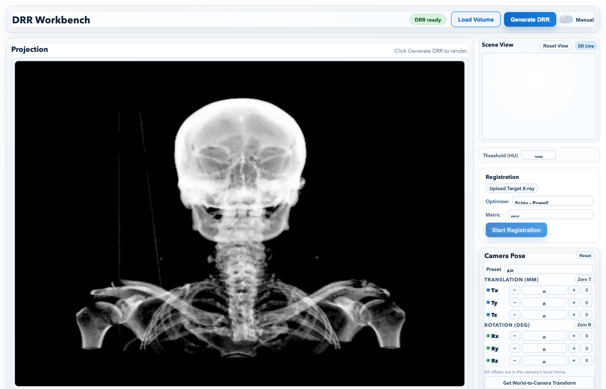
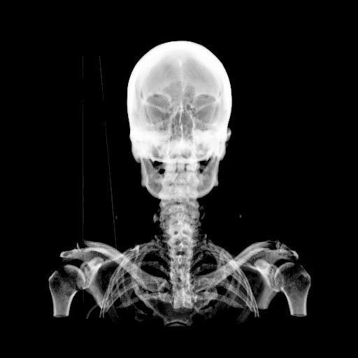
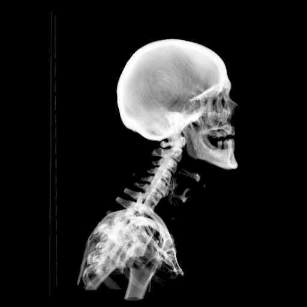

# 2D/3D AutoReg — DRR Workbench

A web-based workbench for **2D/3D image registration** in interventional imaging. Load a CT volume (NIfTI), render synthetic X-rays (DRRs) at arbitrary 6-DOF poses, and automatically register the 3D volume to a target X-ray — all in the browser, with live streaming progress.

<p align="center">
  
</p>

<p align="center">
  
  
</p>

---

## What it does

**Digitally Reconstructed Radiographs (DRRs)** are synthetic X-rays computed from a CT volume using ray tracing. Matching a DRR to a real X-ray gives you the 3D pose of the patient — a core problem in image-guided surgery and radiotherapy.

This workbench implements the full pipeline:

1. Upload a CT volume (NIfTI `.nii.gz`)
2. Interactively adjust the 6-DOF camera pose via sliders or a 3D scene widget
3. Render a DRR at that pose using cone-beam ray tracing on GPU
4. Upload a target X-ray and run automatic pose registration
5. Watch the optimizer converge in real time via WebSocket-streamed progress

---

## Technical highlights

**DRR rendering** — Fully vectorized cone-beam ray tracer built in PyTorch. Rays are cast from a point source through the volume, sampled via trilinear interpolation (`grid_sample`), and attenuated via Beer-Lambert law using HU-derived linear attenuation coefficients. Memory-efficient tiled processing (4096 rays/tile on CPU/MPS, all-at-once on CUDA).

**Registration** — Scipy Powell optimizer (gradient-free) with four similarity metrics: Normalized Cross-Correlation (NCC), gradient correlation, Mean Reciprocal Squared Difference (MRSD), and Mutual Information. Intermediate results stream to the frontend via WebSocket on every function evaluation.

**Multi-user session isolation** — Each browser tab opens a WebSocket that creates an independent session with its own `DRREngine` and optimizer state. A background reaper cleans up stale sessions after 1 hour of inactivity.

**Identical math frontend and backend** — The 6-DOF pose parameterization (camera-relative translation + rotation conjugated to world frame) is implemented identically in Python and JavaScript, preventing visual discontinuity when the frontend previews a pose before the backend renders it.

**Device-agnostic** — Same PyTorch pipeline runs on CUDA, MPS (Apple Silicon), and CPU with automatic device selection and fallbacks.

**Cloud deployment** — A single `deploy_modal.py` script builds and serves the full stack on Modal: Python backend via `uv`, React frontend via `npm run build`, static files served from FastAPI, T4 GPU allocated per function invocation.

---

## Architecture

```
Browser
├── React SPA (Vite)
│   ├── Three.js 3D scene — CT volume wireframe, camera frustum, pose axes
│   ├── 6-DOF pose controls — sliders + presets (AP, LAT, PA)
│   ├── DRR viewer — rendered image with target overlay + opacity slider
│   └── WebSocket client — session lifecycle, registration streaming
│
└── FastAPI backend
    ├── POST /api/drr/generate      — render DRR at pose → base64 PNG
    ├── POST /api/volume/upload     — load CT volume in-memory (no disk write)
    ├── POST /api/registration/target — upload target X-ray
    ├── GET  /api/scene             — volume geometry for 3D widget
    ├── GET  /api/registration/metrics — available similarity metrics
    └── WS   /ws                    — session create/destroy, registration streaming
```

**Coordinate systems:** Backend uses LPS (medical standard: X=right, Y=anterior, Z=superior). Three.js uses Y-up. The mapping `(scene_x, scene_y, scene_z) = (world_x, world_z, −world_y)` is applied consistently throughout.

---

## Quick start

**Requirements:** Python 3.12+, Node 20+, [`uv`](https://docs.astral.sh/uv/)

```bash
make dev    # backend on :8000, frontend on :3000
```

Or manually:

```bash
# Backend
cd backend
uv sync
NIFTI_PATH=../sample_data/HN_P001.nii.gz uv run uvicorn app.main:app --reload --port 8000

# Frontend (in a separate terminal)
cd frontend
npm install && npm run dev
```

> On macOS with both conda and pip PyTorch installed, prefix backend commands with `KMP_DUPLICATE_LIB_OK=TRUE` to suppress duplicate OpenMP warnings.

### Cloud deployment (Modal)

```bash
uvx modal token new                     # one-time auth
uvx modal serve deploy_modal.py         # ephemeral dev serve (hot reload)
uvx modal deploy deploy_modal.py        # permanent deploy
```

---

## Stack

| Layer | Technology |
|-------|-----------|
| Frontend | React 18, Three.js, @react-three/fiber, Vite |
| Backend | FastAPI, PyTorch >= 2.10, SimpleITK, nibabel, scipy |
| Packaging | uv (Python), npm (Node) |
| Cloud | Modal (ASGI, T4 GPU, concurrent inputs) |

---

## Sample data

| File | Description |
|------|-------------|
| `sample_data/HN_P001.nii.gz` | Head/neck CT volume, 512x512x196 voxels (26 MB) |
| `sample_data/target_tx10_ry5.png` | Target X-ray rendered at tx=10 mm, ry=5 deg — use to verify registration |
